# CloudFlare-Configuracao
Manual de configuração de registros de domínio na CloudFlare para segurança do serviço SkyBind.

Necessário criar/acessar a conta na cloudflare https://dash.cloudflare.com
Você pode comprar o domínio, ou caso já tenha comprado em outro registrador, fazer a migração.

# Registrar/Migrar Domínio
Há diversos caminhos, mas já na página inicial podemos ir em Add a Domain e digitar o seu domínio.
Caso ele já exista em outro registrador será apresentada a possibilidade de migrar (Conectar).

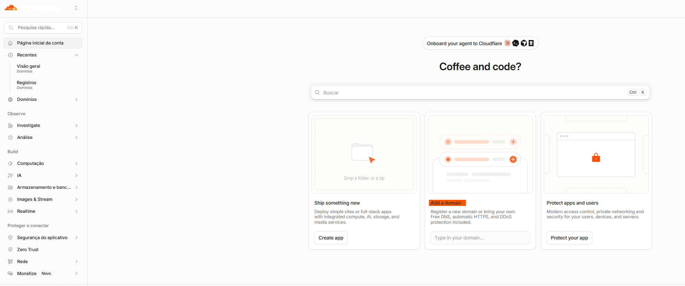
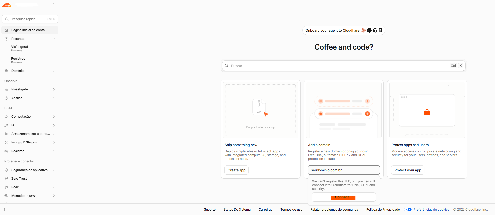

## Migrar registros
A CloudFlare já identifica os registros existentes e migra a configuração automaticamente.


Confirme que a opção esteja marcada para importar automaticamente e clique em continuar.

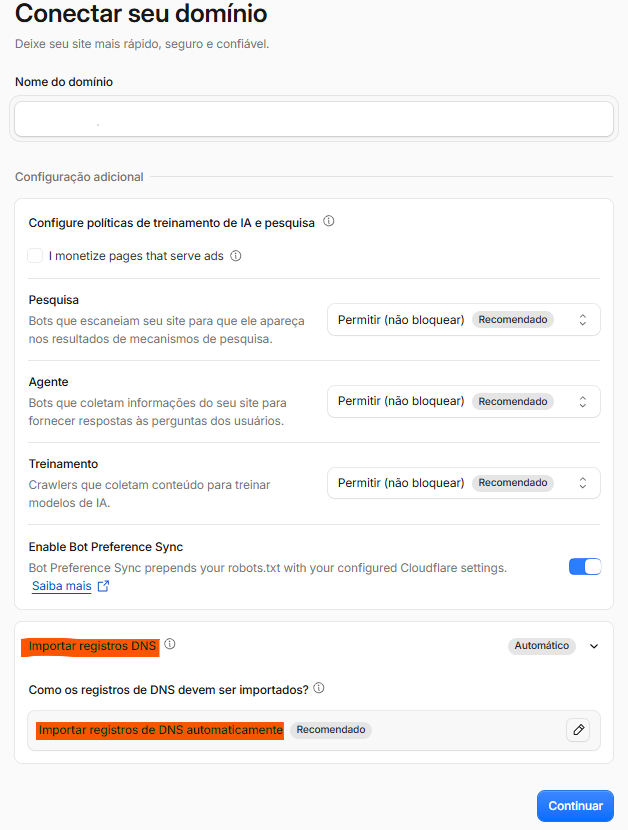

## Escolha do plano
Para necessidade e configurações básicas o plano gratuito basta.

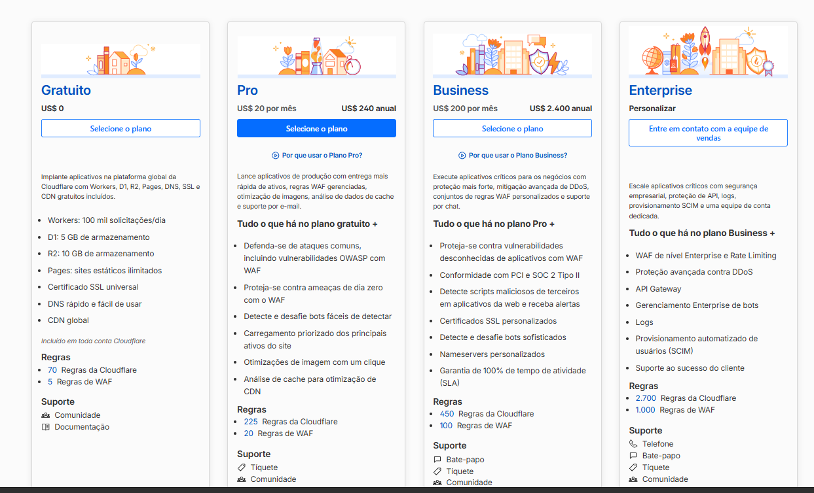

## Registros
É mostrado os registros encontrados, confirme onde está registrado atualmente se tudo foi importado.


Caso falte algo, pode ser adicionado manualmente.

- PROXY: O proxy (ícone laranja 🟠) precisa ser ativado para os domínios que apontam para o skybind. Não configure para outros registros que você não queira usar o proxy da CloudFlare, principalmente se você não sabe se a configuração é aceita.

O site SkyBind está registrado em cfbindclientes.skyinformatica.inf.br.

Esse domínio não pode ser registado em nenhum Hostname no WebServer do server SkyBind.

No server SkyBind só será aceito tráfego vindo da cloudflare.

### Altere ou faça os registros
| Domínio | Tipo | Destino |
|---|---|---|
| `dominioparaositebind.com.br` | CNAME | `cfbindclientes.skyinformatica.inf.br` |
| `www.dominioparaositebind.com.br` | CNAME | `dominioparaositebind.com.br` |

🔴 Se for usado um registro A apontando diretamente para o IP do skybind, caso o ip do server seja trocado futuramente, precisar ser alterado manualmente.

Clique em `Continue para ativação`

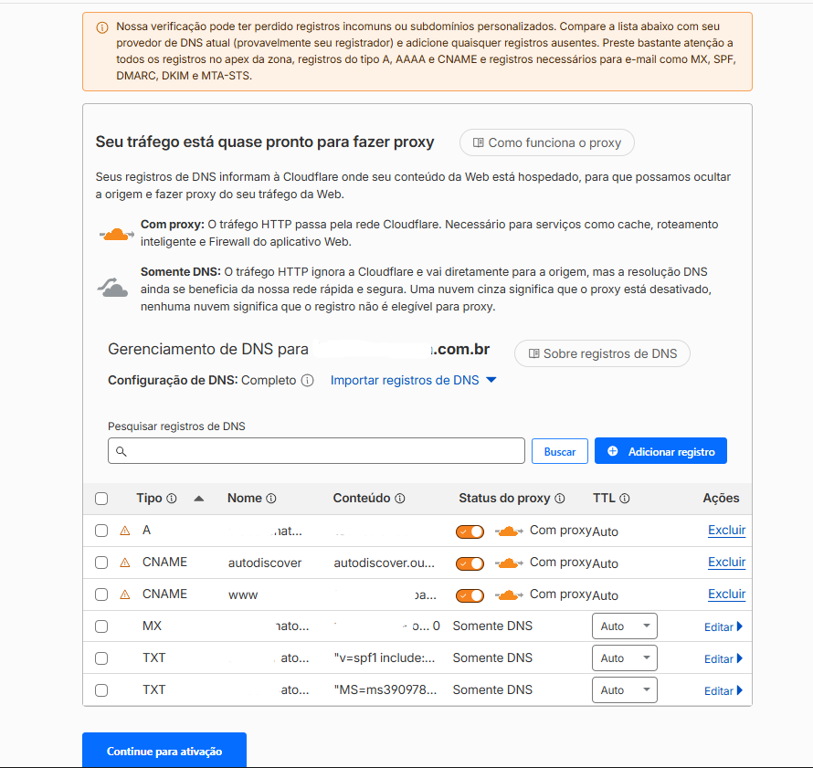


## Configurando NS

O Dashboard entregará os novos nameservers.
Basta configurá-los no registrador atual.

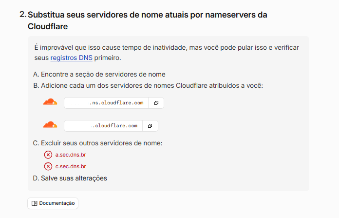
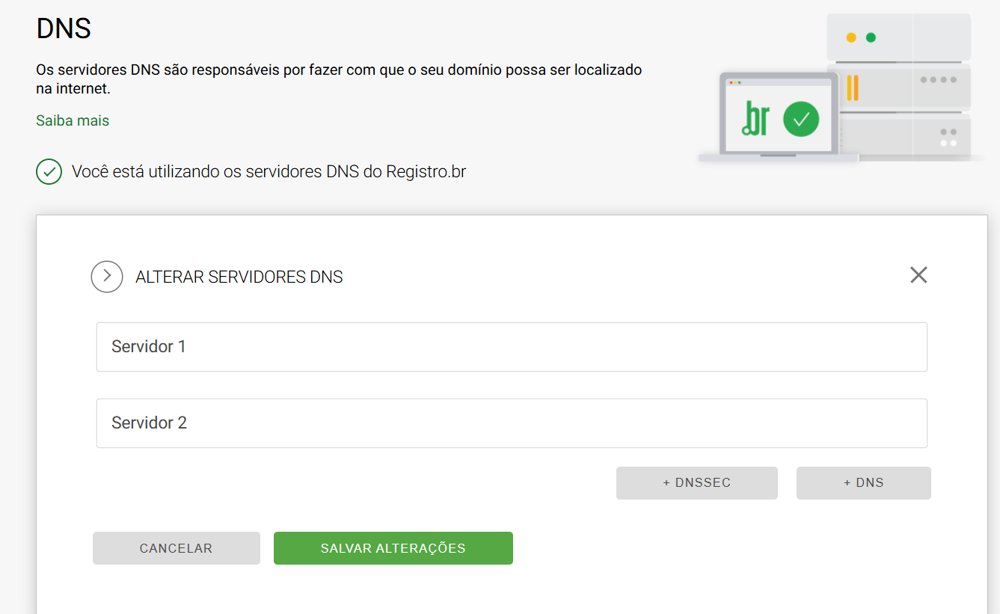


## Propagação
Dependendo de onde está o NS atual, a migração pode demorar de alguns minutos até 48 horas.


Como a configuração já foi feita previamente no novo servidor, assim que passar a resolver por ele já estará funcionando.


O Name Server atual pode ser visto em: https://www.whatsmydns.net


## Regras de Segurança

### BOT FIGHT
No menu esquerdo vá em `Segurança > Configurações`

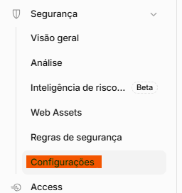

Ative o `Modo Bot Fight`

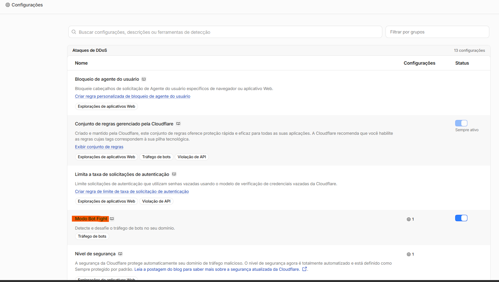

### Regras Personalizadas

Vamos bloquear todo o tráfego de fora do Brasil, mas permitir acesso a url que o let's encrypt usa para completar o desafio para gerar o certificado.
É importante que a regra de liberação do let's encrypt venha antes, por isso criaremos ela primeiro. Mas não haveria problema em criar depois, desde que selecionada a ordem correta na criação.

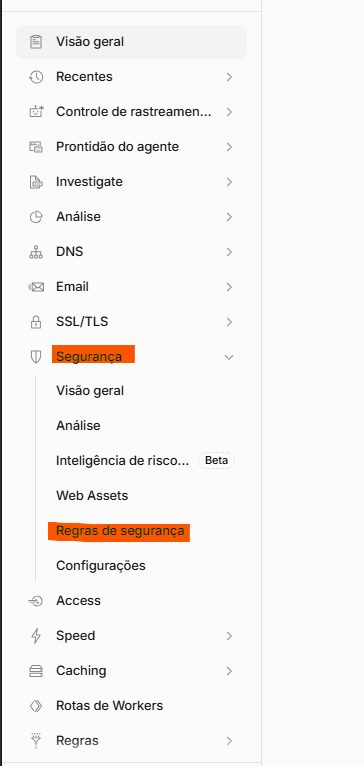
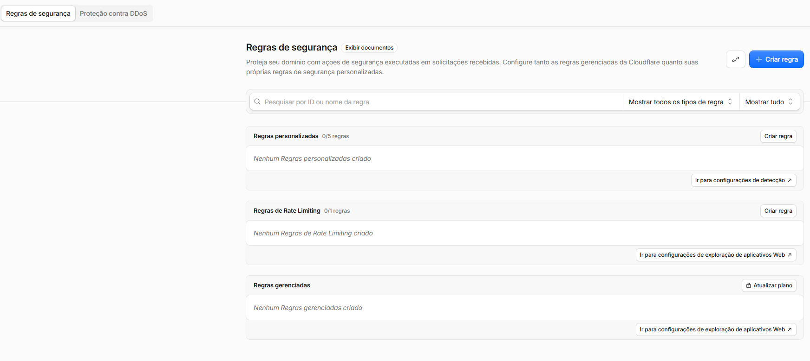
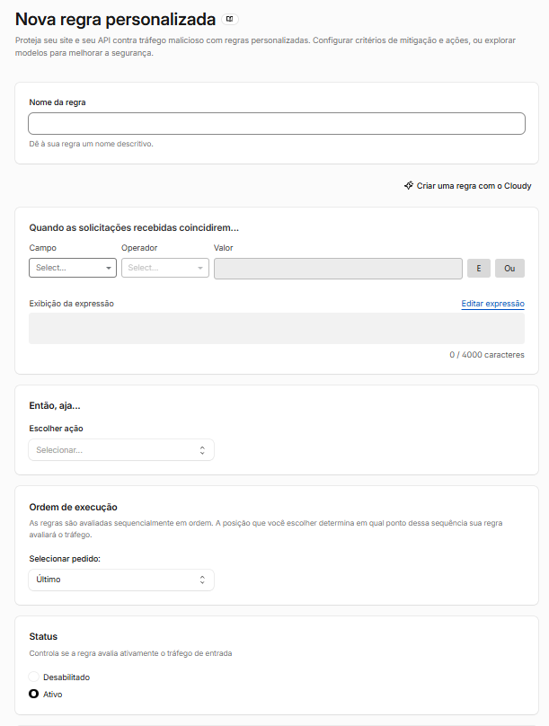

#### 1 Liberar certbot

Coloque o nome: Liberar certbot

Clique em editar expressão e adicione:
```txt
starts_with(http.request.uri.path, "/.well-known/acme-challenge/")
```
A ação é `Ignorar`. `Todas as regras personalizadas restantes`
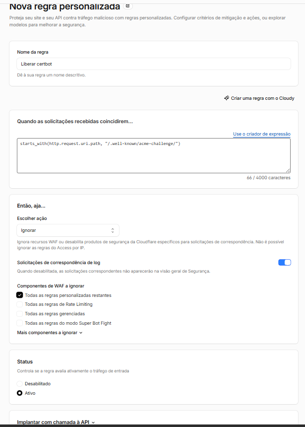


#### 2 Bloquear acesso fora do Brasil

Coloque o nome: Bloquear acesso fora do Brasil

Clique em editar expressão e adicione:
```txt
(not ip.src.country eq "BR")
```
A ação é `Bloquear`. Ela deve estar ativa e ser executada depois de `Liberar certbot` (`segunda`).

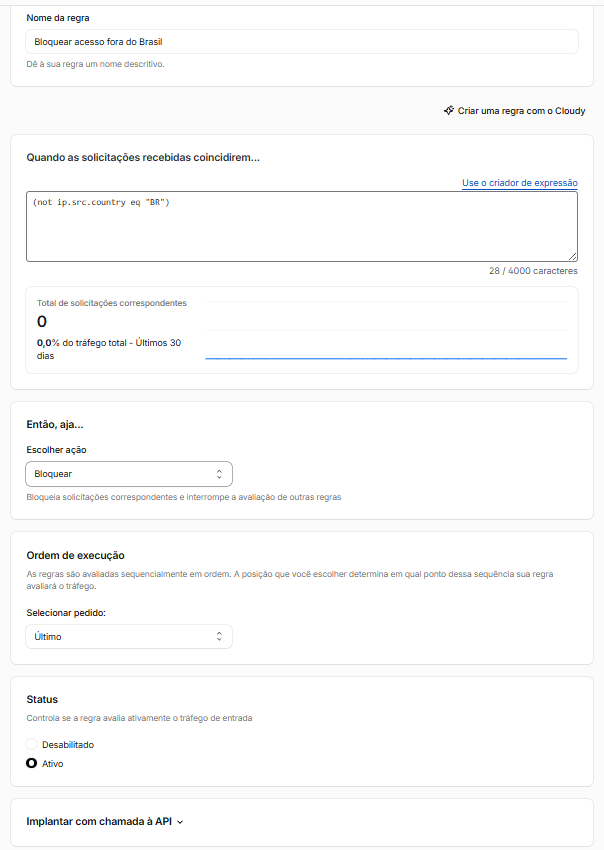

#### 2 Desafio Página de notícias

O objetivo é barrar acesso de bots que varrem páginas de notícias.

Por análise de comportamento, o usuário legítimo dificilmente navega por diversas páginas.
Então, caso seja solicitado navegação na página 10 ou maior, o acesso não será bloqueado, mas a cloudflare fará um verificação se o acesso é legítimo.


Coloque o nome: Desafio Page Alto


Clique em editar expressão e adicione:
```txt
len(http.request.uri.args["page"][0]) ge 2
```
A ação é `Desafio gerenciado`. Ela deve estar ativa e ser executada depois de `Bloquear acesso fora do Brasil` (`última`).

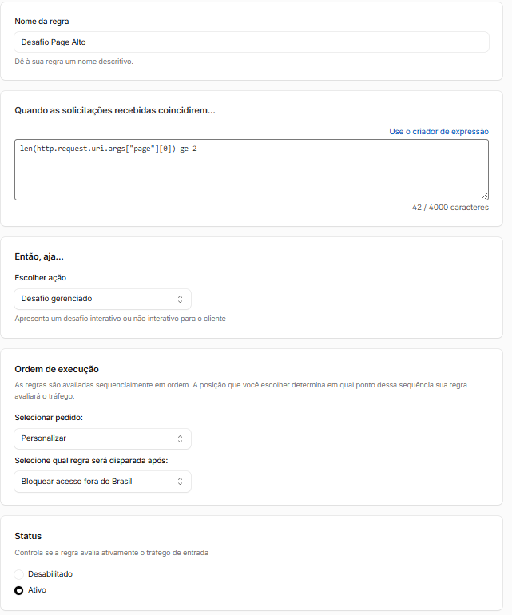


### RESUMO
Resumo das regras personalizadas.

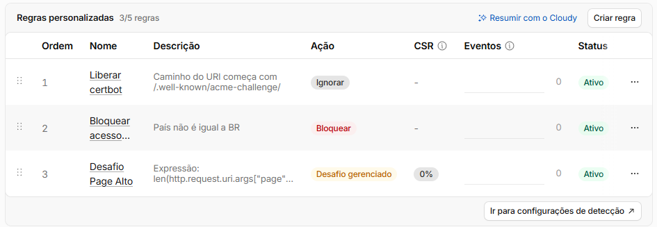

